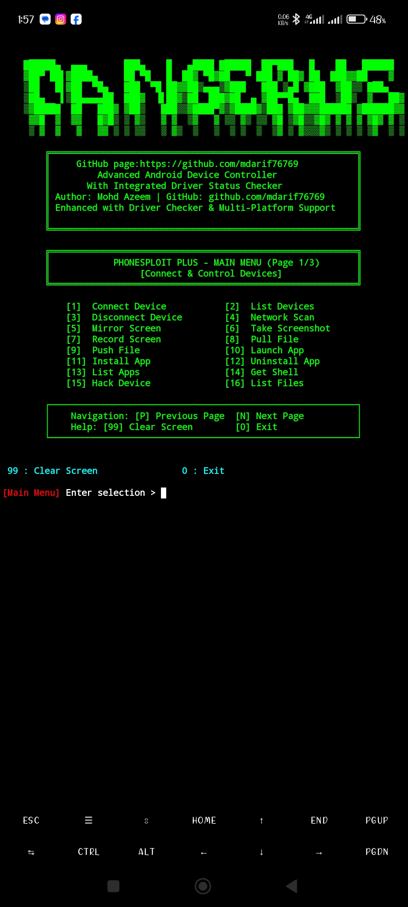
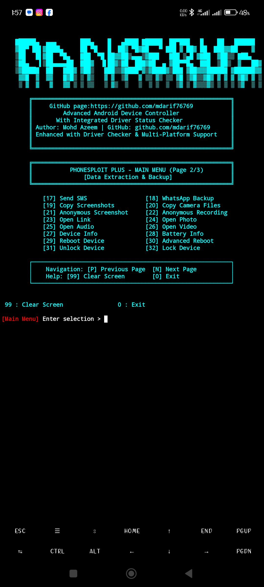

# PhoneSploit Plus - Complete Installation & Usage Guide

## 🎯 What's New in PhoneSploit Plus

এটি একটি **Pro থেকে Plus এ আপগ্রেড** version যেখানে **Driver Status Checker** system যুক্ত করা হয়েছে।

---

## 📦 Installation Guide

### **Windows Installation**

#### **Step 1: Download Python**
1. Go to [python.org](https://github.com/mdarif76769/PhoneSploit_Plus)
2. Download Python 3.8+ (Latest version)
3. Run installer
4. ✅ Check "Add Python to PATH"
5. Click Install

#### **Step 2: Install ADB (Most Important)**
```
Method 1: Download SDK Tools
- Go to https://github.com/mdarif76769/PhoneSploit_Plus
- Download platform-tools-latest-windows.zip
- Extract to C:\platform-tools
- Add to PATH:
  1. Right-click "This PC" → Properties
  2. Click "Advanced system settings"
  3. Click "Environment Variables"
  4. Under "System variables", click "Path" → Edit
  5. Click "New" → Add C:\platform-tools
  6. Click OK

Method 2: Use Chocolatey (Easier)
- Open PowerShell as Administrator
- Run: choco install adb
```

#### **Step 3: Install Other Tools**
```powershell
# Using Chocolatey (recommended)
choco install scrcpy
choco install nmap
choco install git
```

Or download manually from:
- Scrcpy: https://github.com/Genymobile/scrcpy/releases
- Nmap: https://nmap.org/download
- Git: https://git-scm.com/download/win

#### **Step 4: Verify Installation**
```powershell
adb version
scrcpy --version
nmap --version
git --version
```
### Screeneshot Main Menu 
  


[Terminal 3](Screenshot/Screenshot_2026-05-09-13-58-45-989_com.termux.jpg)

### **macOS Installation**
 
 git clone 
 
 https://github.com/mdarif76769/PhoneSploit_Plus
 
#### **Step 1: Install Homebrew**
```bash
/bin/bash -c "$(curl -fsSL https://raw.githubusercontent.com/Homebrew/install/HEAD/install.sh)"
```

#### **Step 2: Install Tools**
```bash
# Update Homebrew
brew update

# Install all tools
brew install android-platform-tools  # ADB
brew install scrcpy
brew install nmap
brew install git
```

#### **Step 3: Verify Installation**
```bash
adb version
scrcpy --version
nmap --version
git --version
```

---

### **Linux Installation (Ubuntu/Debian)**

#### **Step 1: Update Package Manager**
```bash
sudo apt update && sudo apt upgrade -y
```

#### **Step 2: Install Tools**
```bash
# ADB
sudo apt install android-tools-adb android-tools-fastboot

# Scrcpy
sudo apt install scrcpy

# Nmap
sudo apt install nmap

# Git
sudo apt install git

# Python (usually pre-installed)
sudo apt install python3 python3-pip
```

#### **Step 3: Verify Installation**
```bash
adb version
scrcpy --version
nmap --version
git --version
python3 --version
```

---

### **Linux Installation (Fedora/RHEL)**

```bash
# Update system
sudo dnf update -y

# Install tools
sudo dnf install android-tools      # ADB
sudo dnf install scrcpy
sudo dnf install nmap
sudo dnf install git
sudo dnf install python3 python3-pip
```

---

### **Termux Installation (Android)**

#### **Step 1: Open Termux**
1. Download Termux from Google Play Store or F-Droid
2. Open Termux app

#### **Step 2: Update & Install**
```bash
# Update Termux
apt update && apt upgrade -y

# Install required packages
pkg install python python-pip
pkg install android-tools      # ADB
pkg install scrcpy
pkg install nmap
pkg install git

# Grant storage permission
termux-setup-storage
```

#### **Step 3: Create Directory**
```bash
mkdir -p ~/PhoneSploit_plus
cd ~/PhoneSploit_plus
```

#### **Step 4: Download Script**
```bash
# Option 1: Using wget (if you have a URL)
wget -O phonesploit_plus.py "your_file_url"

# Option 2: Copy file manually
nano phonesploit_plus.py
# Paste content, then Ctrl+X → Y → Enter
```

---

## 🚀 Running PhoneSploit Plus

### **Windows**
```powershell
python phonesploit_plus.py
```

### **macOS/Linux**
```bash
python3 phonesploit_plus.py
```

### **Termux**
```bash
python phonesploit_plus.py
```

---

## ✅ Verification Checklist

**Before running the script, verify all installations:**

```bash
# Windows (PowerShell)
adb version          # Should show ADB version
where python         # Should show Python path

# macOS/Linux
adb version
which python3        # or which python
which scrcpy
which nmap
```

---

## 📊 Driver Status Check at Startup

When you run PhoneSploit_Plus, it automatically shows:

```
======================================================================
SYSTEM DRIVER & PACKAGE STATUS CHECK
======================================================================

Package Name         Status            Description
----------------------------------------------------------------------
ADB                  ✓ Installed       Android Debug Bridge
Scrcpy               ✓ Installed       Screen Mirror Tool
Nmap                 ✓ Installed       Network Scanning Tool
Metasploit           ✗ Not Installed   Exploitation Framework
Python               ✓ Installed       Python Runtime
Git                  ✓ Installed       Version Control

----------------------------------------------------------------------
✓ 5/6 packages installed! - 83%

======================================================================
```

---

## 🔧 Troubleshooting Installation

### **Problem: "adb: command not found"**
**Solution:**
- **Windows:** Ensure C:\platform-tools is in PATH, restart PowerShell
- **macOS:** Run `brew install android-platform-tools` again
- **Linux:** Run `sudo apt install android-tools-adb` again
- **Termux:** Run `pkg install android-tools` again

### **Problem: "python: command not found"**
**Solution:**
- **Windows:** Run installer again, ensure "Add Python to PATH" is checked
- **macOS:** Run `brew install python3`
- **Linux:** Run `sudo apt install python3`
- **Termux:** Run `pkg install python`

### **Problem: Path issue after installation**
**Solution:**
```bash
# Linux/macOS - Add to ~/.bashrc or ~/.zshrc
export PATH="$PATH:/path/to/tool"
source ~/.bashrc

# Windows - Restart PowerShell after adding to PATH
```

### **Problem: Permission denied on Linux/Mac**
**Solution:**
```bash
# Make script executable
chmod +x phonesploit_plus.py

# Run with python explicitly
python3 phonesploit_plus.py
```

### **Problem: "ModuleNotFoundError" for nmap**
**Solution:**
```bash
# Install python-nmap
pip install python-nmap
# or
pip3 install python-nmap
```

---

## 📋 Complete Installation Summary

### **Minimum Requirements**
- Python 3.8+
- ADB (Android Debug Bridge)

### **Recommended Setup**
- Python 3.8+
- ADB
- Scrcpy (for screen mirroring)
- Nmap (for network scanning)
- Git (for updates)

### **Optional but Useful**
- Metasploit Framework
- Additional security tools

---

## 🎯 Quick Start (Copy-Paste)

### **Windows (PowerShell as Admin)**
```powershell
# Install Chocolatey first (one-time)
Set-ExecutionPolicy Bypass -Scope Process -Force; [System.Net.ServicePointManager]::SecurityProtocol = [System.Net.ServicePointManager]::SecurityProtocol -bor 3072; iex ((New-Object System.Net.WebClient).DownloadString('https://community.chocolatey.org/install.ps1'))

# Install tools
choco install python adb scrcpy nmap git -y

# Run script
python phonesploit_plus.py
```

### **macOS (Terminal)**
```bash
# Install Homebrew
/bin/bash -c "$(curl -fsSL https://raw.githubusercontent.com/Homebrew/install/HEAD/install.sh)"

# Install tools
brew install python3 android-platform-tools scrcpy nmap git

# Run script
python3 phonesploit_plus.py
```

### **Linux Ubuntu/Debian (Terminal)**
```bash
# Update and install
sudo apt update && sudo apt upgrade -y
sudo apt install python3 python3-pip android-tools-adb scrcpy nmap git -y

# Run script
python3 phonesploit_plus.py
```

### **Termux (Android)**
```bash
# Update and install
apt update && apt upgrade -y
pkg install python python-pip android-tools scrcpy nmap git
termux-setup-storage

# Create directory and run
mkdir -p ~/PhoneSploit && cd ~/PhoneSploit
python phonesploit_plus.py
```

---

## 🐛 Post-Installation Tests

### **Test 1: Check Python**
```bash
python --version        # or python3 --version
```
Expected: Python 3.8 or higher

### **Test 2: Check ADB**
```bash
adb version
```
Expected: Android Debug Bridge version info

### **Test 3: Check Other Tools**
```bash
scrcpy --version
nmap --version
git --version
```

### **Test 4: Run PhoneSploit Plus**
```bash
python phonesploit_plus.py
```
Expected: See driver status check at startup

---

## 📱 Device Setup Requirements

Before using PhoneSploit Plus with an actual device:

1. **Enable USB Debugging**
   - Go to Settings → Developer Options → USB Debugging (ON)

2. **Connect Device**
   - Via USB: `adb devices` should list your device
   - Via Network: `adb connect <device_ip>:5555`

3. **Verify Connection**
   ```bash
   adb devices -l
   ```

---

## 🔐 Security Notes

⚠️ **Important:**
- Only use on devices you own or have permission to access
- USB Debugging should only be enabled on trusted networks
- Keep tools updated for security patches
- Never share your scripts with untrusted sources

---

## 🆘 Getting Help

If you encounter issues:

1. **Check Installation:**
   - Verify all tools are in PATH
   - Restart terminal/shell after PATH changes
   - Try running tools directly

2. **Check Logs:**
   - Run with Python in verbose mode: `python -v phonesploit_plus.py`
   - Check error messages carefully

3. **Reinstall:**
   - Complete uninstall of problematic tool
   - Restart system
   - Reinstall from scratch

---

## 📚 Useful Links

- **ADB**: https://developer.android.com/tools/adb
- **Scrcpy**: https://github.com/Genymobile/scrcpy
- **Nmap**: https://nmap.org
- **Python**: https://python.org
- **Git**: https://git-scm.com
- **Termux Wiki**: https://wiki.termux.com

---

**Version:** 2.0 (Plus Edition with Driver Checker)  
**Last Updated:** May 2026  
**Installation:** Production Ready ✅

### **Startup Screen (Automatic)**

যখন Program run হয় তখন automatically একটি **Driver Status Table** দেখায়:

```
======================================================================
SYSTEM DRIVER & PACKAGE STATUS CHECK
======================================================================

Package Name         Status            Description
----------------------------------------------------------------------
ADB                  ✓ Installed       Android Debug Bridge
Scrcpy               ✗ Not Installed   Screen Mirror Tool
Nmap                 ✓ Installed       Network Scanning Tool
Metasploit           ✗ Not Installed   Exploitation Framework
Python               ✓ Installed       Python Runtime
Git                  ✗ Not Installed   Version Control

----------------------------------------------------------------------
⚠ 3/6 packages installed - 50%

======================================================================
```

### **Status Symbols**
- **✓ Installed** = Green color - Package আছে
- **✗ Not Installed** = Red color - Package নেই

---

## 🎮 How to Check Driver Status

### **Method 1: Automatic at Startup** ✅
Program চালু করলে automatically startup এ দেখা যাবে।

### **Method 2: During Runtime**
Menu এ গিয়ে:
```
[50] Driver Check        → যেকোনো সময় check করুন
[46] System Status       → বিস্তারিত system info দেখুন
```

### **Example Menu Command:**
```
[Main Menu] Enter selection > 50
↓
SYSTEM DRIVER & PACKAGE STATUS CHECK
(Shows full status table)
```

---

## 📋 Supported Drivers/Packages

এই tools check করে:

| Package | Command | Description |
|---------|---------|-------------|
| **ADB** | adb | Android Debug Bridge |
| **Scrcpy** | scrcpy | Screen Mirror Tool |
| **Nmap** | nmap | Network Scanning Tool |
| **Metasploit** | msfconsole | Exploitation Framework |
| **Python** | python | Python Runtime |
| **Git** | git | Version Control System |

---

## 🔧 Installation Guide

### **Linux/Termux**
```bash
# ADB
apt install android-tools

# Scrcpy
apt install scrcpy

# Nmap
apt install nmap

# Metasploit
apt install metasploit-framework

# Git
apt install git
```

### **macOS**
```bash
# Install Homebrew first
/bin/bash -c "$(curl -fsSL https://raw.githubusercontent.com/Homebrew/install/HEAD/install.sh)"

# Then install packages
brew install android-platform-tools
brew install scrcpy
brew install nmap
brew install git
```

### **Windows**
Download from:
- **ADB**: [Android SDK Tools](https://developer.android.com/tools/releases/platform-tools)
- **Scrcpy**: [GitHub Release](https://github.com/Genymobile/scrcpy/releases)
- **Nmap**: [nmap.org](https://nmap.org/download)
- **Git**: [git-scm.com](https://git-scm.com/download/win)

### **Termux**
```bash
pkg update && pkg upgrade
pkg install android-tools scrcpy nmap git
```

---

## 📊 Status Display Examples

### **Example 1: All Installed**
```
ADB                  ✓ Installed       Android Debug Bridge
Scrcpy               ✓ Installed       Screen Mirror Tool
Nmap                 ✓ Installed       Network Scanning Tool
Metasploit           ✓ Installed       Exploitation Framework
Python               ✓ Installed       Python Runtime
Git                  ✓ Installed       Version Control

----------------------------------------------------------------------
✓ All packages installed! (6/6) - 100%
```

### **Example 2: Some Missing**
```
ADB                  ✓ Installed       Android Debug Bridge
Scrcpy               ✗ Not Installed   Screen Mirror Tool
Nmap                 ✓ Installed       Network Scanning Tool
Metasploit           ✗ Not Installed   Exploitation Framework
Python               ✓ Installed       Python Runtime
Git                  ✗ Not Installed   Version Control

----------------------------------------------------------------------
⚠ 3/6 packages installed - 50%
```

---

## 🎨 Color Coding

```
Package Name:        ✓ Installed (Green) ✗ Not Installed (Red)
Description:         Standard White Text
Status Line:         
  - Full Install:    Green ✓
  - Partial:         Yellow ⚠
```

---

## 🚀 Features

✅ **Automatic Check at Startup** - Program চালু হলে automatic check করে  
✅ **Manual Check Anytime** - Menu option [50] থেকে যেকোনো সময় check করুন  
✅ **Beautiful Table Format** - Professional looking status display  
✅ **Color Coded Status** - Green/Red রঙে স্পষ্ট দেখা যায়  
✅ **Percentage Display** - কত % installed তা দেখায়  
✅ **All Platform Support** - Windows, Mac, Linux, Termux সবে কাজ করে  
✅ **Works Without Drivers** - কোনো driver missing থাকলেও program চলে

---

## 💡 Key Improvements Over Previous Version

| Feature | Pro | Plus |
|---------|-----|------|
| Driver Checker | ❌ | ✅ |
| Auto Status Display | ❌ | ✅ |
| Manual Check Command | ❌ | ✅ |
| Color Coding | Basic | Enhanced |
| Installation Guide | ❌ | ✅ |
| System Info Display | ❌ | ✅ |

---

## 🎯 Usage Flow

### **Startup**
```
python phonesploit_plus.py
    ↓
[Auto Check] Driver Status Table দেখা যাবে
    ↓
[Main Menu] এ যাওয়া
    ↓
[50] দিয়ে আবার check করুন (optional)
```

### **Main Menu**
```
[46] System Status     → System info + Driver status
[50] Driver Check     → Driver status শুধু
[99] Clear Screen     → Menu clear করুন
[0]  Exit             → Program বন্ধ করুন
```

---

## 📱 Platform-Specific Notes

### **Termux**
- Startup এ "🤖 Termux Environment Detected!" দেখাবে
- সব driver check ঠিকভাবে কাজ করবে
- Auto detected হবে Termux environment

### **Windows**
- CMD এ run করুন (administrator হতে হবে না)
- সব driver properly detect করবে

### **macOS**
- বেশিরভাগ tools pre-installed থাকে
- Git, Nmap, Scrcpy brew এ পাওয়া যায়

### **Linux**
- সব tools package manager এ পাওয়া যায়
- Ubuntu/Debian: `apt install`
- Fedora: `dnf install`

---

## 🔍 How It Works

```python
# Driver check function
def check_command_exists(command):
    """Check if command exists in system PATH"""
    if windows:
        use 'where' command
    else:
        use 'which' command
    return result

# Status display function
def display_driver_status():
    """Display all drivers with status"""
    For each driver:
        Check if installed
        Show ✓ (green) or ✗ (red)
        Display percentage
```

---

## 🐛 Troubleshooting

### **Problem: Driver shows "Not Installed" but it actually is**
**Solution:**
- Add tool to system PATH
- Restart terminal/shell
- Try again

### **Problem: Can't see colors**
**Solution:**
- Use modern terminal (iTerm2, Konsole, etc)
- Update terminal emulator
- Check UTF-8 encoding

### **Problem: Some drivers not detecting**
**Solution:**
- Ensure tool is in PATH
- Check command name is correct
- Try running command directly in terminal

---

## 📈 Future Enhancements

🔮 **Planned Features:**
- Package installation suggestion
- Quick install commands
- Driver version checking
- Performance benchmark
- Health status report

---

## 🎓 Example Output Explanation

```
Package Name         Status            Description
ADB                  ✓ Installed       Android Debug Bridge
└─ Green ✓           └─ Status color   └─ What it does
```

**Meaning:**
- ADB is **installed and ready to use** (green checkmark)
- It's the **Android Debug Bridge** tool
- Program can use it for device communication

---

## ✅ Verification Checklist

Before using PhoneSploit Plus:

- [ ] Python installed
- [ ] Run program once to see driver status
- [ ] Check which drivers are missing
- [ ] Install missing critical drivers (ADB is most important)
- [ ] Run driver check again to verify

---

## 📞 Support

If drivers don't show as installed:

1. **Verify installation:**
   ```bash
   which adb      # Linux/Mac/Termux
   where adb      # Windows
   ```

2. **Add to PATH if needed**
3. **Restart terminal**
4. **Run driver check again**

---

**Version:** 2.0 (Plus Edition)  
**Feature:** Driver Status Checker  
**Platforms:** Windows, macOS, Linux, Termux  
**Status:** Production Ready ✅
